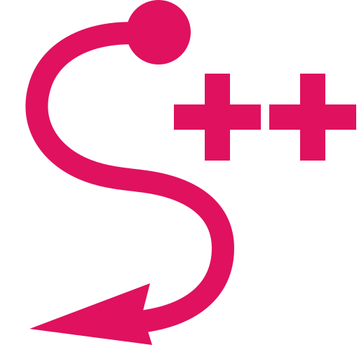

# Strokes++



By GPT-5.6 Sol, Claude Opus 5, Kyle Rose 

## Description
Strokes++ is a native Windows 11 x64 mouse-gesture application inspired by Strokes Plus and
StrokesPlus.net. It runs in the notification area, recognizes configurable single-stroke gestures,
and executes global or application-specific actions.

The action engine supports keyboard shortcut sequences, executable launches, registered URLs and
URIs, mouse input, window manipulation, media commands, output volume, and Windows virtual desktop
commands. Application-profile actions retain first-match precedence over global actions.

This project is not affiliated with the other Strokes projects and does not use their source code.
The primary goal of this project was to see if I could vibe code a working application in a language I have minimal experience with. The secondary goal was to provide open-sourced source code for others to bootstrap their own implementations and extensions.

## Getting started

Install the Windows package or build from source, then start Strokes++. The application runs in the
notification area without a taskbar window. Left-click its icon to enable or disable gestures.
Right-click it to open the menu for Settings, Lua reload, and Exit.

The Global Actions tab shows built-in action assignments and gesture previews. **Add Action**
chooses a gesture or mouse trigger that has no global or application action. **Edit Action** changes the selected global mapping; **Delete Action** removes its mapping without deleting the gesture.
The Applications tab holds profile-specific actions. Use the Gestures tab to browse the full pattern
catalog. Configuration and shared Lua scripts are stored under `%LOCALAPPDATA%\StrokesPlusPlus`.

## Release 1.0.0

- Assign keyboard, mouse, window, media, volume, virtual desktop, process, URL, and Lua actions to
  gestures. Application profiles can override global actions.
- Create Lua actions in the editor, validate or test scripts, and share code through
  `%LOCALAPPDATA%\StrokesPlusPlus\scripts\init.lua` and restricted local modules.
- Use separate **Add Action** and **Edit Action** controls. Add lists gestures and mouse triggers
  without an existing global or application-profile action.
- Install with the NSIS executable or use the portable ZIP. Both include the Visual C++ runtime,
  project license, and Lua license notice.

The installer is unsigned, so verify its published SHA-256 checksum before running it. Strokes++
runs without administrator privileges, as Windows can block automation of elevated apps. Virtual
desktop commands use Windows shortcuts and may report success even when the system does not perform
the requested operation. Configuration remains under `%LOCALAPPDATA%\StrokesPlusPlus` after an
upgrade or uninstall.


## Build
Requirements:

- CMake 3.25 or newer
- A C++20 compiler (Visual Studio with the **Desktop development with C++** workload)

From a Visual Studio Developer PowerShell:

```powershell
.\run.ps1
```

That command configures the build when necessary, builds the Debug application, and starts it in the notification area. To build, run all tests, and then start it:

```powershell
.\run.ps1 -Test
```

To build and test without launching the application:

```powershell
.\run.ps1 -Test -NoRun
```

The equivalent manual commands are:

```powershell
cmake -S . -B build -A x64
cmake --build build --config Debug
ctest --test-dir build -C Debug --output-on-failure
```

Run `build/Debug/StrokesPlusPlus.exe` (or the equivalent configured build directory).
Recognition runs on an engine worker and actions run on a separate action worker. The engine waits
for each action result before processing the next gesture.

## Installer

The Windows installer is built from a tested Release configuration with CMake, CPack, and NSIS.
Install [NSIS](https://nsis.sourceforge.io/) and run (or set `STROKES_NSIS` to the full path of
`makensis.exe`):

```powershell
.\package.ps1
```

The installer is written to `build-package/packages`. It installs Strokes++ and the required
Visual C++ runtime files, creates Start Menu and Desktop shortcuts, registers an uninstaller in
Windows Apps, and preserves user configuration under `%LOCALAPPDATA%\StrokesPlusPlus` when the
application is upgraded or removed. To create both the installer and a portable ZIP package, run:

```powershell
.\package.ps1 -Format Both
```

The package script builds Release, runs the full test suite, and generates a SHA-256 file for each
package. For example, verify the installer with:

```powershell
$installer = 'build-package\packages\StrokesPlusPlus-0.10.0-win64.exe'
Get-FileHash -Algorithm SHA256 $installer
Get-Content "$installer.sha256"
```

The packages are currently unsigned. Check the published checksum before running an installer
downloaded from elsewhere.

See [release steps](RELEASING.md) for the publication checklist.

## Action configuration schema

Actions are stored under `global_actions` or a profile's `actions` object. Each mapping has a
`type`, action schema `version`, and type-specific parameters. Examples:

```json
{
  "close-tab": {"type":"keyboard","version":1,"shortcut":"CTRL+W"},
  "terminal": {
    "type":"process","version":1,"operation":"launch","path":"wt.exe",
    "arguments":"-d C:\\Projects","working_directory":"C:\\Projects"
  },
  "website": {"type":"url","version":1,"url":"https://example.com"},
  "click-origin": {
    "type":"mouse","version":1,"operation":"click","button":"left",
    "position":{"type":"gesture_start"}
  },
  "maximize": {
    "type":"window","version":1,"operation":"maximize","target":"gesture_window"
  },
  "pause": {"type":"media","version":1,"operation":"play_pause"},
  "quieter": {"type":"volume","version":1,"operation":"decrease","amount":5},
  "next-desktop": {"type":"virtual_desktop","version":1,"operation":"next"}
}
```

Mouse positions may be `current_cursor`, `gesture_start`, `gesture_end`, or `absolute`; absolute
positions include numeric `x` and `y`. Window targets may be `gesture_window`,
`foreground_window`, or `window_at_gesture_start`. Move actions add the required `x` and `y` fields,
resize actions add `width` and `height`, and move-resize actions add all four. A move action ignores
stored width and height; a resize action ignores stored x and y coordinates.

Phase 1 keyboard records without an action-level `version` remain supported and are written in the
versioned representation on the next save. Invalid mappings are skipped independently, so valid
sibling mappings remain usable; the log identifies rejected global or profile mapping IDs.

## Lua scripting

Choose **Lua Script** in the global or application-profile action editor. Shared startup code is
loaded from `%LOCALAPPDATA%\StrokesPlusPlus\scripts\init.lua`; restricted modules are loaded with
`require` from its `modules` subdirectory. Both are created on first run, and **Reload Lua Scripts**
in the notification-area menu rebuilds the runtime from their current contents, which also clears
values scripts have stored in Lua globals.

**Validate** reports syntax errors without running the script. **Test** runs it immediately against
the same automation services a gesture would use, so it can move windows and send input. A tested
script was not produced by a gesture: the `gesture` and `application` globals are absent, and window
functions report that the target is unavailable.

The editor's **API Help** button lists every namespace and signature. Automation functions return
`true` on success and raise a catchable Lua error on failure. Query functions return the requested
value. Available namespaces are `gesture`, `application`, `keyboard`, `mouse`, `window`, `process`,
`shell`, `media`, `volume`, `desktop`, `ui`, and `log`.

- `keyboard`: `hotkey(key, ...)` sends one chord; `press(key)` sends one key down and up and
  rejects `+` or `,`; `down(key)`, `up(key)`, and `is_down(key)`.
- `mouse`: `position()`, `move(x, y)`, and `click`, `double_click`, `down`, or `up(button)`.
- `window`: lifecycle and geometry operations plus `bounds`, `exists`, `title`, `class`, and
  `process` queries; the optional target is `gesture` or `foreground`.
- `process.launch(path [, arguments [, working_directory]])` and `shell.open(uri)`.
- `media`: `play_pause()`, `next()`, `previous()`, and `stop()`.
- `volume`: `increase(amount)`, `decrease(amount)`, `toggle_mute()`, `get()`, `set(value)`, and
  `is_muted()`.
- `desktop`: `next()`, `previous()`, `create()`, and `close()`.
- `ui.message(text)` and `ui.osd(text)` display an on-screen message that dismisses itself; both
  return immediately, so feedback never blocks the script or the engine.
- `log`: `debug(text)`, `info(text)`, `warn(text)`, and `error(text)` write structured diagnostics.
  `print(...)` writes to the same log at info level, because the application has no console.

`gesture` exposes the recognized ID/name/score, start and finish points, duration, point count, and
distance. `application` exposes process identity, executable path, and captured window metadata.
Both context objects are read-only.

The supported environment provides the base, `math`, `string`, `table`, and `utf8` libraries.
`dofile`, `loadfile`, `rawset`, `rawget`, `rawequal`, and `rawlen` are removed: the first two read
the filesystem, and the raw accessors would write through the metatables that keep the context
objects read-only. A script that runs longer than one second is interrupted and reported as a
failed action.

## Windows security boundary

Strokes++ is designed to run without administrator privileges. Windows User Interface Privilege
Isolation (UIPI) can prevent its `SendInput` keyboard shortcuts from reaching an application
running at a higher integrity level, such as an administrator-elevated window. This is an expected
Windows security restriction. The action is reported as an injection failure when Windows exposes
the failure. Elevated-process automation is unsupported. Windows may also deny process-image
queries for elevated windows. In that case, process-name profile matching is unavailable, while
title and window-class criteria can still be used.

The same integrity boundary applies to synthetic mouse, media, and virtual-desktop input. Windows
may deny foreground activation even for a valid window; this is reported as an action failure.
URLs and URIs require a registered shell handler. Volume actions require an available default
output endpoint. Virtual desktop actions use Windows 11 system shortcuts; switching at the first or
last desktop is a harmless no-op, and behavior can vary on unsupported Windows versions. Strokes++
does not yet detect whether those shortcuts are available, so a virtual desktop action reports
success whenever Windows accepts the keystrokes, even on a system where they do nothing. Runtime
capability detection is planned.

The application has no built-in network communication, analytics, cloud synchronization, or update
checks. User-configured process, URI, and Lua actions can launch other applications or network
handlers. Logs for the current run use structured JSON lines in `log.txt` in the launch directory,
falling back to the executable directory if needed.

## License

This project is licensed under the [MIT License](LICENSE). Lua's separate notice is in
[THIRD_PARTY_NOTICES.txt](THIRD_PARTY_NOTICES.txt), which is included in release packages.

Copyright (c) 2026 Kyle Rose
